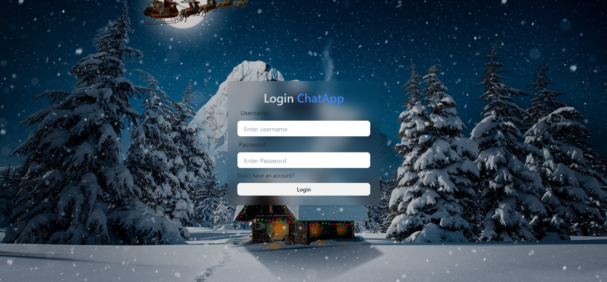
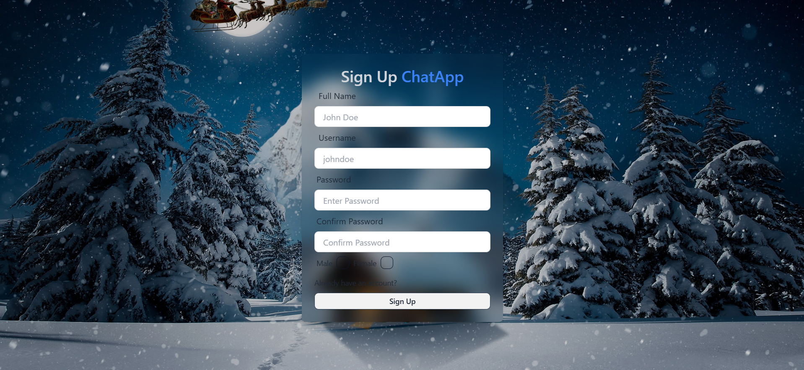
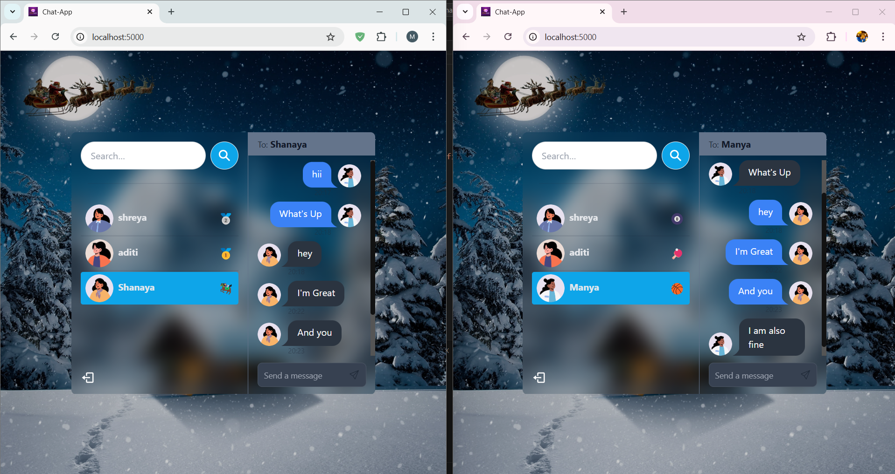

# Live-chat-Application


A full-stack blog application built using the MERN (MongoDB, Express, React, Node.js) stack.

## Installation

### Prerequisites
Make sure you have the following installed:
- [Node.js](https://nodejs.org/)
- [MongoDB](https://www.mongodb.com/)
- [npm](https://www.npmjs.com/) or [yarn](https://yarnpkg.com/)

### Backend (Node.js + Express + MongoDB)
1. Navigate to the backend folder:
   ```sh
   cd backend
   ```
2. Install dependencies:
   ```sh
   npm install
   ```
3. Create a `.env` file and add the required environment variables (MongoDB URI, JWT Secret, etc.)
4. Start the backend server:
   ```sh
   npm start
   ```

### Frontend (React.js)
1. Navigate to the frontend folder:
   ```sh
   cd frontend
   ```
2. Install dependencies:
   ```sh
   npm install
   ```
3. Start the React app:
   ```sh
   npm run dev
   ```

## How to Start the App
1. Start the backend server first:
   ```sh
   cd backend
   npm start
   ```
2. Then start the frontend:
   ```sh
   cd frontend
   npm start
   ```
3. Open the app in your browser at:
   ```
   http://localhost:3000
   ```

## Screenshots
### Login Page


### Signup Page


### Conservation Page



## Contributing
Feel free to fork this repository and submit pull requests.

## License
This project is licensed under the MIT License.
